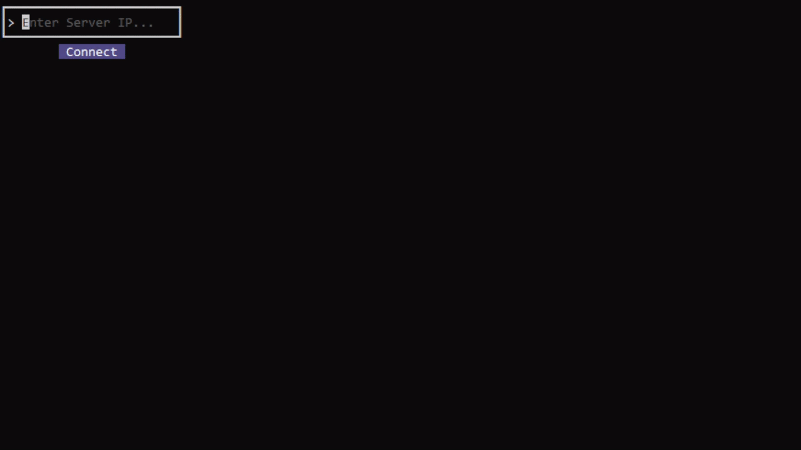

<div align="center">

  [](https://github.com/DenisKozarezov/ws-battleship/blob/master/README.md)

  [](https://github.com/DenisKozarezov)

  <h1>Battleship Websocket Game</h1>

</div>

## Usage

If you want to play straight in IDE/editor, then download the project and run `server` and `client` Go-files. Make sure you have installed Go with a minimum version 1.25:
```shell
# git clone
git clone https://github.com/DenisKozarezov/ws-battleship.git

# open the project
cd ws-battleship

# start Go-files
go run ws-battleship-server/cmd/main.go
go run ws-battleship-client/cmd/main.go
```

Local Multiplayer is available at your `localhost:8080`, so try to connect to `127.0.0.1` or `0.0.0.0` IP-address of the running server.

> [!INFO]
> Server is configured at port :8080 by default.

## Demo

### 1. Main Menu



### 2. Multiplayer Game


### 3. Chat

